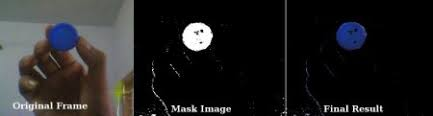

# Sistema de Automação Logística com Visão Computacional

<!--
Vídeo da ponte em funcionamento
-->
<p align="center">
  
</p>

## Descrição do Projeto

O Sistema de Automação Logística com Visão Computacional é uma solução inovadora que combina robótica, visão computacional e comunicação serial para otimizar a logística em um ambiente automatizado. Utilizando uma ponte rolante controlada por um ESP32, o sistema é capaz de identificar, localizar e mover contêineres de diferentes cores de forma precisa e eficiente.

O video do pitch inicial do projeto pode ser encontrado [aqui](https://youtu.be/iw18S4EYCus?si=bXUdSKVfdXWQbk5L).

O video do projeto final em funcionamento pode ser encontrado [aqui](/media/under_development.gif).

## Componentes do Sistema

### Hardware:
   - **ESP32:** Microcontrolador responsável pelo controle dos motores e comunicação serial.
   - **Motores de Translação:** Permitem o movimento longitudinal (frente/trás) e movimento transversal (esquerda/direita) da ponte rolante.
   - **Ponte H:** Controla o movimento dos motores de translação.
   - **Servo Motor 360° Contínuo:** Utilizado para elevar e baixar a carga.
   - **Eletroímã:** Para pegar e soltar os contêineres.
   - **Relé:** Utilizado para ativar e desativar o eletroímã.
   - **Sensores de Fim de Curso:** 4 sensores para limitar a translação da ponte.
   - **Sensor Reflexivo Infravermelho TCRT5000:** Utilizado para verificar se o eletroímã já está posicionado em cima do contêiner ou já chegou ao chão.
   - **Interruptores:** Para acionar e desativar componentes como a chave geral, ponte H, luzes, entre outros.
   - **Câmera:** Integrada à ponte rolante para capturar imagens dos contêineres.
   - **Carrinho Seguidor de Linha:** Transporta os contêineres da área de carga para a área de descarga e depois volta à área de carga.

#### Você pode visualizar o *esquemático do hardware da ponte rolante* em [PDF](doc/Schematic_crane.pdf).

#### Além disso, também pode visualizar o *esquemático do hardware do carrinho autônomo* em [PDF](doc/Schematic_car_linefollower.pdf).

### Software (Bibliotecas utilizadas):
- **[OpenCV:](https://docs.opencv.org/4.x/d1/dfb/intro.html)** Biblioteca de visão computacional para processamento de imagens.
- **[PySerial:](https://pyserial.readthedocs.io/en/latest/pyserial.html)** Interface de comunicação entre o ESP32 e o sistema de visão computacional.
- **[Customtkinter:](https://customtkinter.tomschimansky.com/documentation/)** Biblioteca para criação de interfaces gráficas personalizadas.
- **[CTkSpinbox:](https://pypi.org/project/CTkSpinbox/)** Widget para criação de spinboxes no customtkinter.
- **[PIL:](https://pillow.readthedocs.io/en/stable/)** Biblioteca para manipulação de imagens.
- **[CTkMessagebox:](https://github.com/Akascape/CTkMessagebox)** Widget para criação de messageboxes no customtkinter.

## Funcionamento

O sistema captura imagens através da câmera integrada na ponte rolante e utiliza a biblioteca OpenCV para processar essas imagens e identificar containers por suas respectivas cores. O usuário pode selecionar, através de uma interface, a quantidade e tipo de containers desejados, e o sistema irá operar conforme as escolhas feitas.

## Estrutura do Repositório

- **crane.ino:** Código em C++ embarcado no ESP32, responsável pelo controle de todos os componentes da ponte rolante.
- **thresholds-identifier.py:** Utilizado para identificar bons valores no espaço de cores HSV para identificar cada uma das cores antes da execução do código principal.
- **containers_identification.py:** Código principal que executa simultaneamente com o microcontrolador ESP32, processando a imagem e enviando as informações via comunicação serial.
- **interface.py:** Implementa a interface gráfica para a seleção de quantidade e tipo de containers.
- **my_serial.py:** Implementação das funções usadas para realizar a comunicação serial.
- **utils.py:** Funções auxiliares no funcionamento do projeto, desde a identificação dos contêineres através do OpenCV até a seleção de cores e quantidades.

## Instalação e Configuração

### Requisitos

- ESP32
- Python 3.x
- OpenCV
- Bibliotecas adicionais conforme especificado nos arquivos `.ino` e `.py` (descritas no arquivo `requirements.txt`)

### Passos para Configuração

1. Clone o repositório:
   ```bash
   git clone https://github.com/ThiagoLahass/Crane-automated-through-computer-vision.git
   ```

2. Instale as dependências Python listadas no arquivo `requirements.txt`:
   ```bash
   pip install -r requirements.txt
   ```

3. Compile e carregue o código `crane.ino` no ESP32 utilizando a Arduino IDE.

4. Execute `thresholds-identifier.py` para identificar os valores de cor HSV ideais. Após isso, ajuste os valores das variáveis para cada uma das cores em `containers_identification.py`. Por exemplo, os valores para a cor vermelha devem ser definidos em `H_MIN_RED`, `H_MAX_RED`, `S_MIN_RED`, `S_MAX_RED`, `V_MIN_RED`, `V_MAX_RED`.

5. Execute `containers_identification.py` para iniciar o processamento da imagem e a comunicação serial com o ESP32.

## Utilização

1. **Identificação de Cores:**
   Execute `thresholds-identifier.py` para ajustar os valores HSV das cores.
    <p align="center">
      
    </p>

2. **Interface de Seleção:**
   Utilize a interface para selecionar a quantidade e tipo de containers.
    <p align="center">
      
    </p>

3. **Operação Automática:**
   Após a seleção, o sistema operará automaticamente para mover e posicionar os containers conforme especificado.
   <p align="center">
      
   </p>

## Contribuição

1. Faça um fork do projeto.
2. Crie uma branch para sua feature (`git checkout -b feature/nova-feature`).
3. Commit suas mudanças (`git commit -am 'Adiciona nova feature'`).
4. Faça um push para a branch (`git push origin feature/nova-feature`).
5. Abra um Pull Request.

## Desenvolvedores

- **Thiago Felippe Neitzke Lahass** - *Desenvolvedor Principal* - [Thiago Lahass](https://github.com/ThiagoLahass)
- **Gabriel Gatti da Silva** - [Gabriel Gatti](https://github.com/gabrielgatti7)
- **Bruno Santos Fernandes** - [Bruno Santos](https://github.com/BrunoSantosFF)

## Agradecimentos

Agradecemos a todos os contribuidores e apoiadores deste projeto, principalmente ao Prof. Dr. Rodolfo da Silva Villaça e Prof. Dr. Ricardo Carminati de Mello.